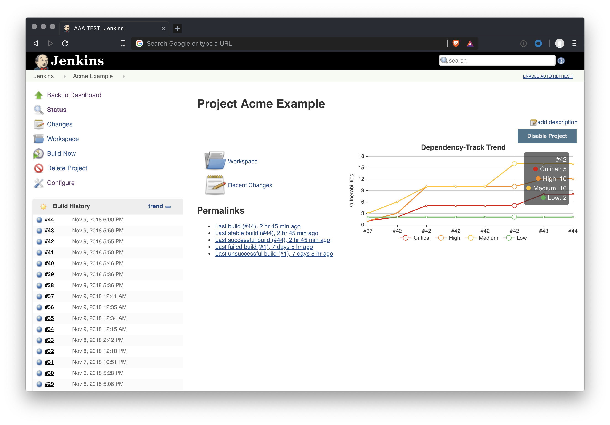
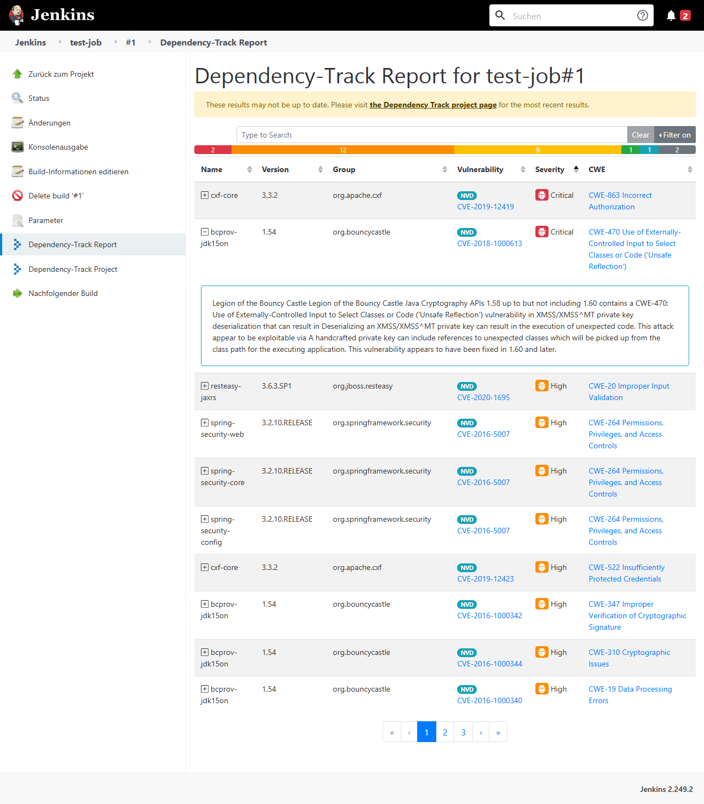
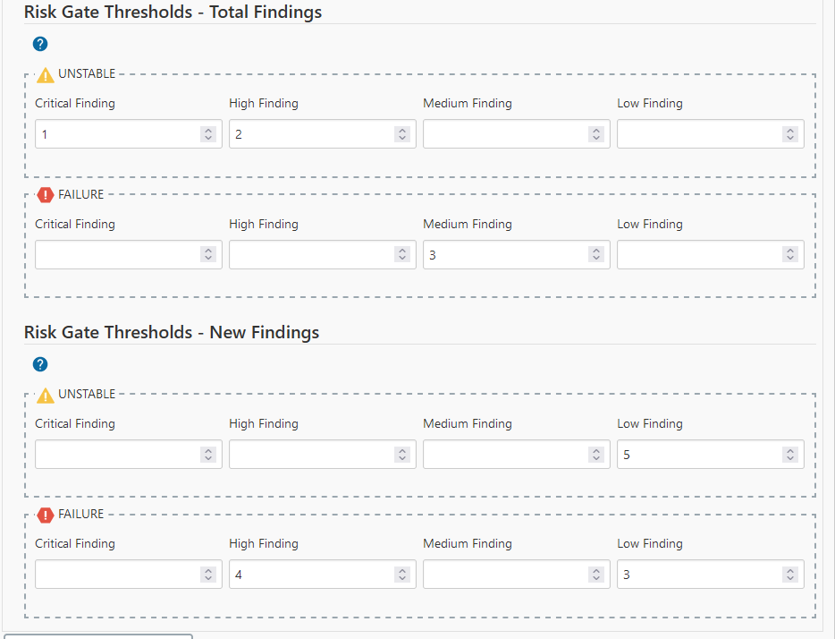

[](https://github.com/jenkinsci/dependency-track-plugin/actions?query=workflow%3A%22CI+build%22)
[](https://sonarcloud.io/dashboard?id=org.jenkins-ci.plugins%3Adependency-track)
[](https://sonarcloud.io/dashboard?id=org.jenkins-ci.plugins%3Adependency-track)
[](LICENSE.txt)
[](https://plugins.jenkins.io/dependency-track/)
[](https://plugins.jenkins.io/dependency-track/)
[](https://github.com/jenkinsci/dependency-track-plugin/issues)
[](https://dependencytrack.org/)

# Dependency-Track Jenkins Plugin

The [Dependency-Track](https://dependencytrack.org/) Jenkins plugin aids in publishing [CycloneDX](https://cyclonedx.org/) Software Bill-of-Materials (SBOM) to the Dependency-Track platform.

[Dependency-Track](https://dependencytrack.org/) is an intelligent Software [Supply Chain Component Analysis](https://owasp.org/www-community/Component_Analysis) platform that allows organizations to 
identify and reduce risk from the use of third-party and open source components.

Publishing SBOMs can be performed asynchronously or synchronously.

Asynchronous publishing simply uploads the SBOM to Dependency-Track and the job continues. Synchronous publishing waits for Dependency-Track to process the SBOM after being uploaded. Synchronous publishing has the benefit of displaying interactive job trends and per build findings.





## Global Configuration
To setup, navigate to Jenkins > System Configuration and complete the Dependency-Track section.


**Dependency-Track Backend URL**: URL to the Backend of your Dependency-Track instance.

**API key**: API Key used for authentication.

**Auto Create Projects**: auto creation of projects by giving a project name and version. The API key provided requires the `PROJECT_CREATION_UPLOAD` permission to use this feature.

**Dependency-Track Frontend URL**: URL to the Frontend of your Dependency-Track instance. Use this if you run backend and frontend on different servers. If omitted, "Dependency-Track Backend URL" will be used instead.

**Polling Timeout**: Defines the maximum number of minutes to wait for Dependency-Track to process a job when using synchronous publishing.

**Polling Interval**: Defines the number of seconds to wait between two checks for Dependency-Track to process a job when using synchronous publishing.

**Connection Timeout**: Defines the maximum number of seconds to wait for connecting to Dependency-Track.

**Response Timeout**: Defines the maximum number of seconds to wait for Dependency-Track to respond.

## Job Configuration
Once configured with a valid URL and API key, simply configure a job to publish the artifact.


**Dependency-Track project**: Specifies the unique project ID to upload SBOM to. This dropdown will be automatically populated with a list of active projects.

**Dependency-Track project name**: Specifies the name of the project for automatic creation of project during the upload process. This is an alternative to specifying the unique ID. It must be used together with a project version. Only avaible if "Auto Create projects" is enabled. The use of environment variables in the form `${VARIABLE}` is supported here.

**Dependency-Track project version**: Specifies the version of the project for automatic creation of project during the upload process. This is an alternative to specifying the unique ID. It must be used together with a project name. Only avaible if "Auto Create projects" is enabled. The use of environment variables in the form `${VARIABLE}` is supported here.

**Artifact:** Specifies the file to upload. Paths are relative from the Jenkins workspace. The use of environment variables in the form `${VARIABLE}` is supported here.

**Enable synchronous publishing mode**: Uploads a SBOM to Dependency-Track and waits for Dependency-Track to process and return results. The results returned are identical to the auditable findings but exclude findings that have previously been suppressed. Analysis decisions and vulnerability details are included in the response. Synchronous mode is possible with Dependency-Track v3.3.1 and higher. The provided API key requires the `VIEW_VULNERABILITY` permission to use this feature with Dependency-Track v4.4 and newer!

**Update project properties**: Allows updating of some project properties after uploading the BOM. The provided API key requires the `PORTFOLIO_MANAGEMENT` permission to use this feature! These properties are:
- tags
- SWID tag ID
- group/vendor
- description

**Override global settings**: Allows to override global settings for "Auto Create Projects", "Dependency-Track URL", "Dependency-Track Frontend URL" and "API key".

### Thresholds

When Synchronous mode is enabled, thresholds can be defined which can optionally put the job into an UNSTABLE or FAILURE state.



**Total Findings:** Sets the threshold for the total number of critical, high, medium, or low severity findings allowed. If the number of findings equals or is greater than the threshold for any one of the severities, the job status will be changed to UNSTABLE or FAILURE.

**New Findings:** Sets the threshold for the number of new critical, high, medium, or low severity findings allowed. If the number of new findings equals or is greater than the previous builds finding for any one of the severities, the job status will be changed to UNSTABLE or FAILURE. The previous build is the one that is successful and has an analysis result of Dependency-Track, which does not necessarily have to be the immediately previous build.

## Examples
### Declarative Pipeline

```groovy
pipeline {
    agent any

    stages {
        stage('dependencyTrackPublisher') {
            steps {
                withCredentials([string(credentialsId: '506ed685-4e2b-4d31-a44f-8ba8e67b6341', variable: 'API_KEY')]) {
                    dependencyTrackPublisher artifact: 'target/bom.xml', projectName: 'my-project', projectVersion: 'my-version', synchronous: true, dependencyTrackApiKey: API_KEY, projectProperties: [tags: ['tag1', 'tag2'], swidTagId: 'my swid tag', group: 'my group']
                }
            }
        }
    }
}
```

### Scripted Pipeline

```groovy
node {
    stage('dependencyTrackPublisher') {
        try {
            dependencyTrackPublisher artifact: 'target/bom.xml', projectId: 'a65ea72b-5b77-40c5-8b19-fb83525f40eb', synchronous: true
        } catch (e) {
            echo 'failed'
        }
    }
}
```

## Copyright & License

Dependency-Track and the Dependency-Track Jenkins Plugin are Copyright © Steve Springett. All Rights Reserved.

Permission to modify and redistribute is granted under the terms of the Apache 2.0 license.

## Changes
Please refer to [CHANGELOG.md](CHANGELOG.md) for a list of changes.
